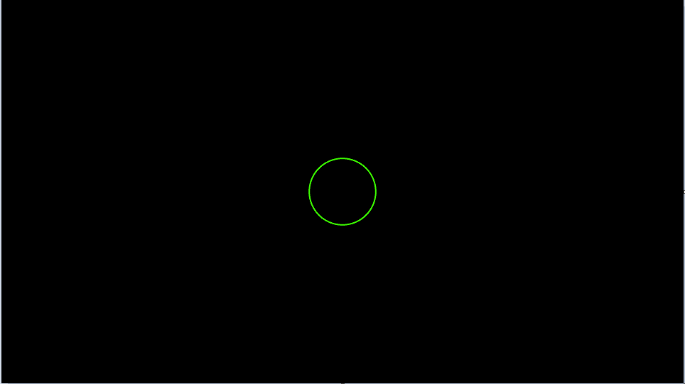
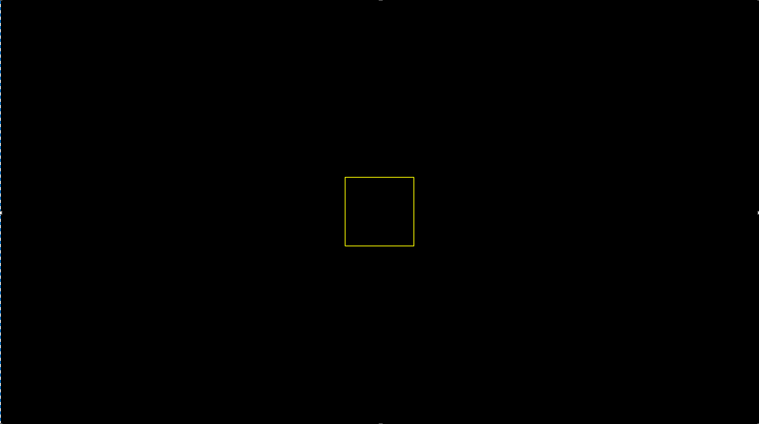
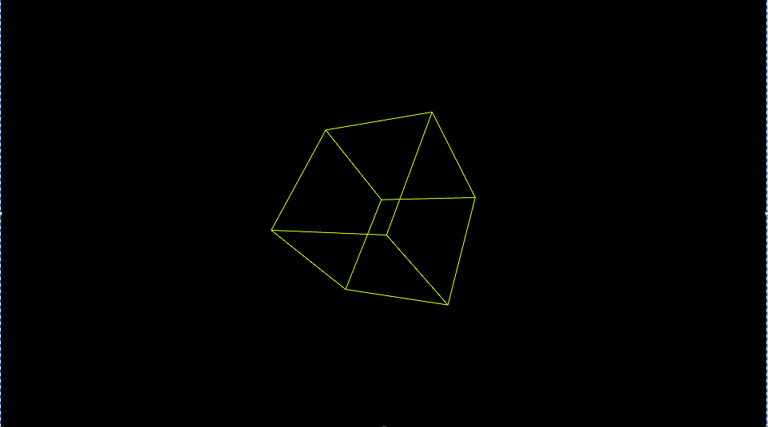
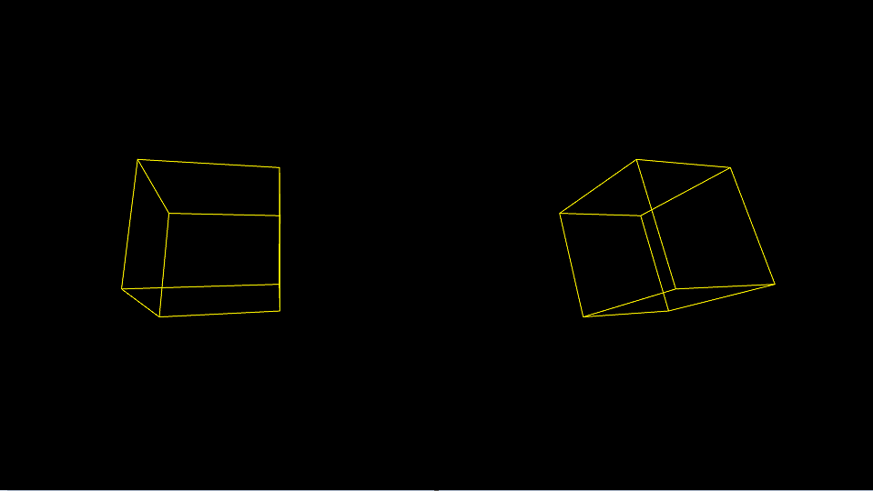
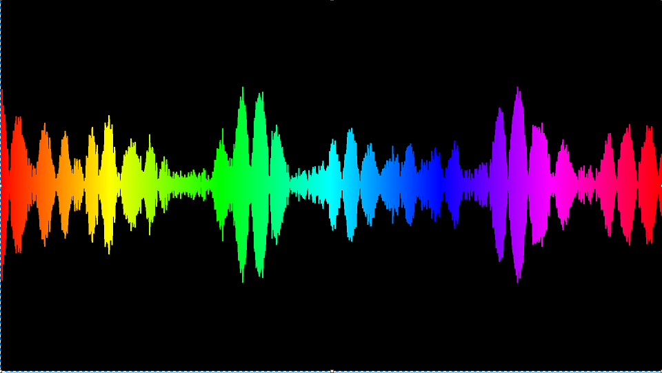
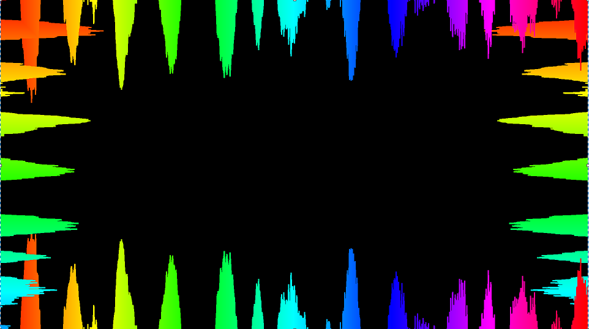

# Music Visualiser Project

Name: Klaudiusz Nowakowski

Student Number: C19412272

## Instructions
- Fork this repository and use it a starter project for your assignment
- Create a new package named your student number and put all your code in this package.
- You should start by creating a subclass of ie.tudublin.Visual
- There is an example visualiser called MyVisual in the example package
- Check out the WaveForm and AudioBandsVisual for examples of how to call the Processing functions from other classes that are not subclasses of PApplet

# Description of the assignment
This program uses different java processing libraries to connect to the minim and make the audio from a song interact with different shapes and change colour as the song is playing. The theme of this assesement is "something beautiful to enjoy while listening to music". I was required to make a youtube video demonstrating how my assignment operates which can be located down below.

# Instructions
This assignment works on a simple menu basis. Press buttons between 0 and 4 to change in between each audio visualiser. Also press esc to close the program and the song.

# How it works
When you press to run the program a song should start playing and a shape that interacts with the audio. I implemented a menu to traverse through next audio visualiser. To go to next shape you need to press on your keyboard a number between 0 to 4. You automatically start at 0, so to move onto next shape press a button between 1 and 4. When you press to move onto the next audio visualiser you should see a new shape that also interacts with the song. When you press 2, it will bring up a cube that rotates around itself. You can also press the up arrow key on your keyboard you should be able to see a duplicate being created of the cube. To exit the program press esc and it close the window and stop the music from playing. 

# What I am most proud of in the assignment
What am most proud of is implementing the cube to be there and rotate around itself. I like the way it is 3D, it creates this unique look and the way it interacts with the audio and expands looks simply looks amazing and cool. Im most proud of this because anyone can just make a simple 2D shape however making a 3D shape is more challenging cause you have to ensure all the angles are correct making it a bit more difficult, however the fact the 3D shape was a bit harder to add it made it just a bit more satisfying at the end when it worked. Also I loved the making the long audio bar that is responsive to sound and it increases when the notes get higher in the song.

# Markdown Tutorial

This is a list of audio visualisers that were used in this assignment:

0. ellipse
1. rectangle
2. cube (3D) UP arrow to duplicate the cube
3. Audio bar - sound responsive
4. Audio bars going around the edge of screen


This is a sample code from my assignment:

```Java
case 3:
            {
                 // Iterate over all the elements in the audio buffer
                 for (int i = 0; i < ab.size(); i++) {

                    float c = map(i, 0, ab.size(), 0, 255);
                    stroke(c, 255, 255);
                    lerpedBuffer[i] = lerp(lerpedBuffer[i], ab.get(i), 0.1f);        
                    line(i, halfHeight - lerpedBuffer[i] * halfHeight * 2, i, halfHeight + lerpedBuffer[i] * halfHeight * 2);
                }        
                break;
            }

            case 4:
            {
                for (int i = 0; i < ab.size(); i++) {

                    float c = map(i, 0, ab.size(), 0, 255);
                    stroke(c, 255, 255);
                    lerpedBuffer[i] = lerp(lerpedBuffer[i], ab.get(i), 0.1f);        
                    line(0, i, lerpedBuffer[i] * halfHeight * 2, i);
                    line(width, i, width - (lerpedBuffer[i] * halfHeight * 2), i);
                    line(i, 0, i, lerpedBuffer[i] * halfHeight * 2);
                    line(i, height, i, height - (lerpedBuffer[i] * halfHeight * 2));
                }        
                break;
            } 
```


Picture 1: Ellipse



Picture 2: Rectangle



Picture 3: Cube



Picture 4: Duplicate Cube



Picture 5: Audio Bar



Picture 6: Audio Bar around the edge of screen




This is a youtube video:

[](https://www.youtube.com/watch?v=J2kHSSFA4NU)


